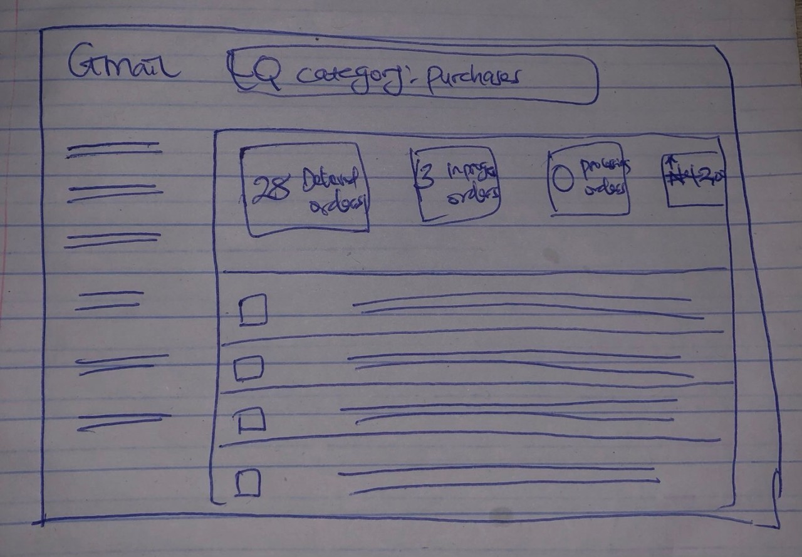
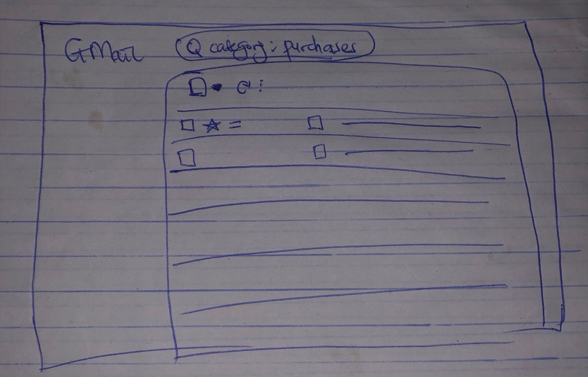

# Smart Purchases Dashboard (Gmail Purchases Tab – UX Improvement Concept)

Most people don’t know that Gmail has a **Purchases** tab that automatically collects all your online shopping emails in one place. Even I didn’t notice it existed until recently. And when I finally checked it out, I realised something — it has so much potential, but the current experience feels like a filtered inbox, not a helpful tool.

This project reimagines the Purchases tab as a **smart, easy-to-understand dashboard** that helps users track their orders, view receipts, and get quick spending insights — without digging through emails.

> **Note:** This is a **concept project** created for learning and UX improvement purposes. It is not an official Google product.

---

## ✨ Why This Matters

Online shoppers (like me and many people I spoke to) constantly search Gmail to find:

- Order confirmations  
- Payment receipts  
- Delivery updates  
- Refund or cancellation emails  

It gets repetitive and messy.

The feature already exists, but most users don’t know about it — or don’t find it useful enough to adopt.

This project explores how a few simple UX improvements can turn a “hidden feature” into something people genuinely use and love.

---

## 🧠 The Idea

The goal is to make the Purchases tab more **visible, organized, and actionable** by:

- Grouping purchases into clear stages  
- Making it quicker to find what you need  
- Showing light insights to help users stay aware of their spending  

---

## 🚀 Key Improvements in This Concept

### 📍 1. Clear Purchase Stages (Not Just a List)

Instead of a long list that feels like a regular inbox, purchases are grouped into meaningful stages:

- **Pending Payment** – Order placed but payment still processing  
- **On The Way** – Delivery in progress  
- **Delivered** – Successfully received  
- **Refunded / Cancelled** – Orders reversed  

This helps users see the status of all orders at a glance.

---

### 🔎 2. Filters That Match How Users Actually Search

Quick ways to filter purchases:

- By **Vendor** (Temu, Amazon, Jumia, AliExpress, Shein, etc.)  
- By **Category** (fashion, food, electronics, beauty, home, etc.)  
- By **Month**  
- By **Delivery Status**  

No more scrolling endlessly to find “that one receipt.”

---

### 📊 3. Light Analytics & Spending Insights

A simple spending summary at the top of the tab such as:

> **₦42,000 spent this month • 12 orders • Top vendor: Temu**

This gives users a quick picture of their online spending habits without needing an extra app.

---

## 🖼️ Concept Sketches

These sketches show the evolution of the idea:

| View | Description |
|-------|----------------|
| **Current Purchases Tab (Existing)** | A filtered inbox view showing all purchase-related emails, but without structure, insights, or clarity. It works, but users still have to open multiple emails to get basic information. |
| **Improved Concept (Smart Dashboard)** | My redesigned version with analytics at the top, grouped purchase stages, and easy filters. Everything a user needs to know is visible at a glance, without opening emails one by one. |

* A simple breakdown of how the Purchases tab currently works: it’s basically a filtered list of purchase-related emails with no clear structure or insights. I sketched this to understand what already exists. *

* My upgraded version adds a small analytics summary at the top (spend, number of orders, top vendor), then shows the purchase emails below. * 

---

## 👤 Who This Is For

- Frequent online shoppers  
- Anyone who buys from multiple vendors  
- People who track receipts for budgeting  
- Students and busy professionals who want quick clarity  
- Users who love efficiency and dislike “email searching”  

---

## 🧩 What This Repository Contains

- **README.md** – Overview of the concept and UX reasoning  
- **systemArchitecture.md** – A technical blueprint of how this could be built  
- **Sketches/Mockups** – Visuals showing the current vs improved design  

---

